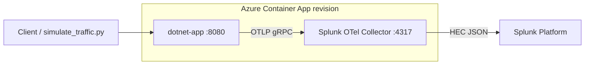

# Azure Container Apps + .NET 8 + ILogger + Splunk OpenTelemetry (lab)

Small **ASP.NET Core** sample that runs on **Azure Container Apps** with the **Splunk distribution of the OpenTelemetry Collector** as a **sidecar**. The app exports **traces, metrics, and logs** (including **ILogger**) to the collector over **OTLP**; the collector forwards to **Splunk Platform** via **HTTP Event Collector (HEC)**.

This layout is suitable for workshops: **minimal SKU choices**, optional **scale-to-zero**, and **no secrets in Git**.

**Repository path (this lab):** `dotnet/` inside [ps-dba-client/ACI](https://github.com/ps-dba-client/ACI).  
**Local workspace mirror:** `azure/aci/dotnet/` under your HL tree.

## What you get

| Telemetry | How |
|-----------|-----|
| **Traces** | ASP.NET Core + `HttpClient` instrumentation, plus a custom `ActivitySource` with **three manual spans** (`lab.workflow`, `lab.fetch-details`, `lab.persist-result`) under the inbound HTTP span. |
| **Logs** | `ILogger` via **OpenTelemetry logging** → OTLP → collector → Splunk HEC. |
| **Correlation** | OpenTelemetry attaches **trace** context to **log records** when `Activity.Current` is set (typical for request-scoped work). In Splunk, use the same **trace ID** on logs and traces. |

### Splunk resource attributes (service identity)

| Field | Source in this lab |
|-------|---------------------|
| **`service.name`** | `OTEL_SERVICE_NAME` (default `aca-dotnet-otel-lab` in Terraform). |
| **`deployment.environment`** | `OTEL_RESOURCE_ATTRIBUTES` and collector `DEPLOYMENT_ENVIRONMENT` (Terraform `deployment_environment`, default `lab`). |

See inline documentation in `src/AcaOtelLab/Program.cs` for client-facing notes and Splunk doc links.

## Architecture



Both containers share the **same network namespace**; the app uses `OTEL_EXPORTER_OTLP_ENDPOINT=http://127.0.0.1:4317`.

## Prerequisites (Windows-oriented)

- **Azure subscription** and **Azure CLI** (`az login`).
- **Terraform** ≥ 1.5.
- **Python 3** (optional) for `scripts/simulate_traffic.py`.
- **.NET SDK 8** (optional) for local runs; **not** required for deploy if you use **ACR cloud build** only.

## Secrets and configuration — do not commit

- **Splunk HEC token** and any **access tokens** belong in `terraform.tfvars` (gitignored) or in **environment variables** such as `TF_VAR_splunk_hec_token`.
- **`terraform/terraform.tfvars.example`** shows non-secret fields only; copy it to `terraform.tfvars` and fill in real values locally.
- Never paste production tokens into issues, README, or pull requests.

### Example: Windows PowerShell for Terraform variables

```powershell
cd terraform
Copy-Item terraform.tfvars.example terraform.tfvars
notepad terraform.tfvars   # add splunk_hec_url, splunk_index, splunk_hec_token, etc.
```

Or for a single session:

```powershell
$env:TF_VAR_splunk_hec_token = '<your-hec-token>'
$env:TF_VAR_splunk_hec_url   = 'https://http-inputs-<stack>.splunkcloud.com/services/collector/event'
$env:TF_VAR_splunk_index    = '<index>'
```

Terraform requires these values even for the **first** targeted apply, because they appear in the Container App resource definition.

## Deploy (automated — Windows)

From the folder that contains **`Dockerfile`** and **`otel-collector\`** (this repo’s `dotnet` directory):

```powershell
.\scripts\deploy.ps1
.\scripts\deploy.ps1 -ImageTag v2
```

The script:

1. Applies Terraform **targets** that create the **resource group**, **Log Analytics**, **Container Apps environment**, and **ACR**.
2. Runs **`az acr build`** twice (cloud build; **no local Docker** needed): **.NET app** and **collector sidecar** images.
3. Runs a **full** `terraform apply` to create/update the **Container App**.

## Deploy (manual)

```powershell
cd terraform
terraform init

terraform apply -target=azurerm_resource_group.main `
  -target=azurerm_log_analytics_workspace.main `
  -target=azurerm_container_app_environment.main `
  -target=azurerm_container_registry.acr

$rg  = terraform output -raw resource_group_name
$acr = terraform output -raw acr_name
cd ..

az acr build -g $rg -r $acr -f Dockerfile -t aca-otel-dotnet:v1 .
az acr build -g $rg -r $acr -f otel-collector/Dockerfile -t aca-otel-collector:v1 .

cd terraform
terraform apply
```

## Outputs

```powershell
cd terraform
terraform output public_url
```

## Generate traffic (validation)

```powershell
$base = terraform -chdir=terraform output -raw public_url
python .\scripts\simulate_traffic.py --base-url $base
# If Python reports SSL certificate errors (common behind TLS inspection), lab-only:
python .\scripts\simulate_traffic.py --base-url $base --insecure
```

Then in **Splunk Search** (examples — adjust field names to your sourcetype parsing):

- Logs: narrow by `service.name` / `service_name` / `"aca-dotnet-otel-lab"` and `deployment.environment` / `lab`.
- Pick a **trace ID** from a log event and search: `trace_id="<id>"` (field names may appear as `traceId` / `otel.trace_id` depending on HEC mapping).

The `/work` endpoint returns a **`trace_id`** JSON field for quick copy/paste during demos.

## Cost notes (lab)

- **Container Apps**: consumption; set `min_replicas = 0` in `terraform.tfvars` for scale-to-zero (cold starts).
- **ACR Basic**: small monthly charge; delete the resource group when finished.
- **Log Analytics**: billed per ingestion; retention set to **30** days in Terraform.

## Project layout

- `src/AcaOtelLab/` — .NET 8 web API.
- `Dockerfile` — application image.
- `otel-collector/collector.yaml` — OTLP in, **HEC** out (tokens via env, not baked in).
- `otel-collector/Dockerfile` — sidecar image (config baked in; still no secrets).
- `terraform/` — Azure resources.
- `scripts/deploy.ps1` — Windows deploy helper.
- `scripts/simulate_traffic.py` — traffic generator.

## References

- [Instrument your .NET application | Splunk Observability](https://docs.splunk.com/observability/en/gdi/get-data-in/application/otel-dotnet/instrumentation/instrument-dotnet-application.html)
- [Log correlation | OpenTelemetry .NET](https://opentelemetry.io/docs/languages/dotnet/logs/correlation/)
- [Splunk Distribution of OpenTelemetry Collector](https://docs.splunk.com/observability/en/gdi/opentelemetry/opentelemetry.html)

## Troubleshooting

- If the collector fails to expand `${env:...}` in `collector.yaml`, check your Splunk OTel Collector version; this lab pins **`0.108.1`** in `otel-collector/Dockerfile`.
- Confirm **HEC URL** matches your Splunk Cloud stack (`https://http-inputs-…splunkcloud.com/services/collector/event` is common for structured events).
- Use **Azure Portal → Container App → Logs** if revisions fail to start (image pull, probe, etc.).
